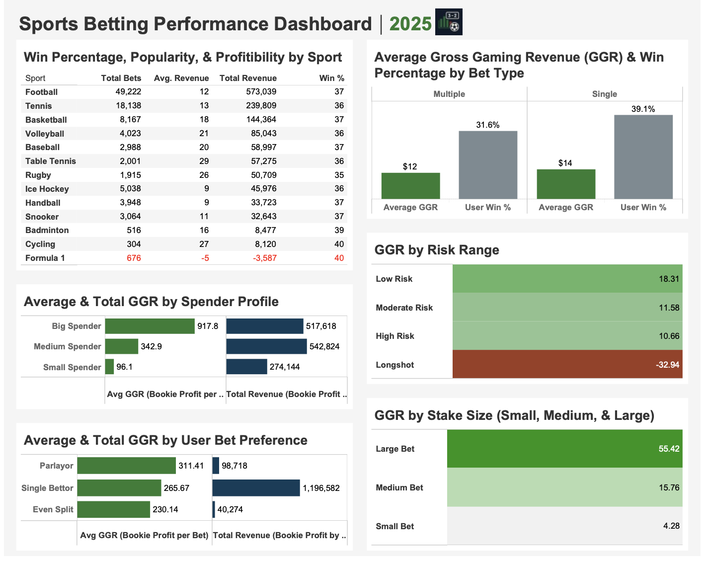

# Sports Betting Performance Analysis

**Tools:** SQL | Tableau  
**Dataset:** Kaggle Sports Betting Dataset (100k rows)  

This project looks at sports betting from the bookmaker’s perspective, exploring how bettor behavior, bet types, and risk levels affect profitability. I used SQL to dig into the data and Tableau to visualize the insights.

## What I Did
- Pulled and cleaned the dataset in MySQL  
- Wrote queries with joins, CTEs, subqueries, and window functions to answer key questions  
- Built a Tableau dashboard to visualize trends and patterns  

## Key Questions Explored
- Which types of bettors generate the most revenue?  
- Which sports and bet types are most profitable?  
- Do single or multiple bets perform better for the house?  
- How do stake size and risk affect profit and loss?  

## Key Takeaways
- Low-risk bettors and bigger stakes drive consistent profit  
- Longshots and Formula 1 bets tend to lose money  
- Single bets win more often but still bring in strong revenue  
- Players stake similar amounts regardless of risk, showing opportunities for strategy  

## Dashboard

